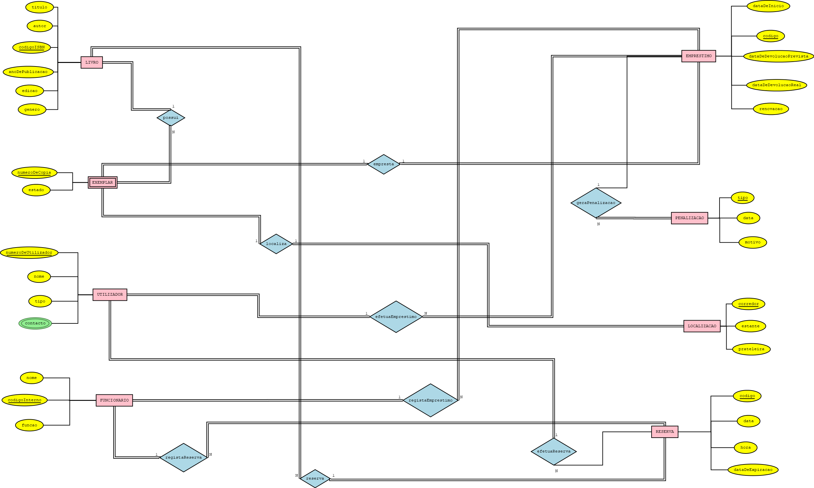

# C2: Esquema Conceptual

### Diagrama Entidade-Associação (EA)

# Entidades e Associações

## Utilizador
A entidade **Utilizador** representa os alunos, professores e funcionários da universidade que interagem com o sistema da biblioteca.  
Cada utilizador possui um identificador único (Número de Utilizador) e é caracterizado por atributos como **Nome**, **Tipo de Utilizador** (Aluno, Professor, Funcionário) e **Contacto**.  
Cada utilizador pode efetuar múltiplos empréstimos e reservas.

## Funcionário
A entidade **Funcionário** representa os colaboradores responsáveis pela gestão administrativa da biblioteca.  
Cada funcionário possui um **Código Interno**, **Nome** e **Função** (ex.: Bibliotecário, Técnico de Arquivo).

## Livro
A entidade **Livro** representa as obras disponíveis na biblioteca.  
Inclui atributos como **Título**, **Autor**, **Código ISBN**, **Ano de Publicação**, **Edição** e **Género**.  
Cada livro pode ter vários exemplares físicos associados.

## Exemplar
A entidade **Exemplar** representa cada cópia física individual de um livro.  
Os atributos incluem **Número de Cópia** e **Estado** (Disponível, Emprestado, Danificado).  
Cada exemplar pertence exclusivamente a um livro e está localizado num ponto físico da biblioteca.

## Localização
A entidade **Localização** identifica onde o exemplar está fisicamente armazenado.  
Inclui **Corredor**, **Estante** e **Prateleira**.  
Cada exemplar tem uma localização única.

## Empréstimo
A entidade **Empréstimo** regista a ação de um utilizador ao requisitar um exemplar.  
Contém os atributos **Código**, **Data de Início**, **Data de Devolução Prevista**, **Data de Devolução Real** e informação sobre **Renovação**.  
Cada empréstimo está associado a um único utilizador e exemplar.

## Reserva
A entidade **Reserva** representa a ação de reservar um livro que, no momento, não se encontra disponível.  
Inclui **Código**, **Data**, **Hora** e **Data de Expiração**.  
Está associada a um utilizador e a um livro específico.

## Penalização
A entidade **Penalização** regista sanções aplicadas a utilizadores em caso de incumprimento das regras de empréstimo.  
Inclui **Tipo de Penalização**, **Data** e **Motivo**.  
Está relacionada a empréstimos que originaram a infração.

---

# Regras de Negócio Adicionais (Restrições)

- Um exemplar não pode ser emprestado a dois utilizadores simultaneamente.
- Um exemplar danificado deve ser sinalizado e retirado de circulação até ser reparado ou substituído.
- Um utilizador não pode efetuar uma nova reserva para um livro que já tenha reservado e esteja pendente.
- Não é permitido eliminar o histórico de empréstimos e penalizações – o histórico deve ser permanente.
- Um empréstimo só pode ser registado se existir um exemplar disponível associado.
- A renovação de um empréstimo só é permitida caso o exemplar não tenha reservas pendentes.
- Uma reserva expira automaticamente se não for convertida num empréstimo dentro do prazo definido.
- Funcionários devem validar manualmente o estado do exemplar no momento da devolução para verificar danos.

---

[< Anterior](rei02.md) | [^ Principal](/../../) | [Próximo >]
:--- | :---: | ---: 
