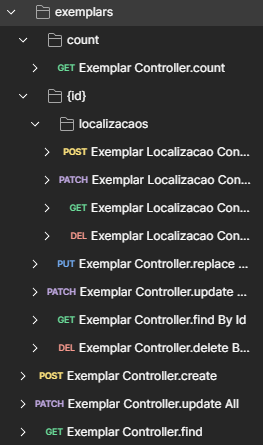
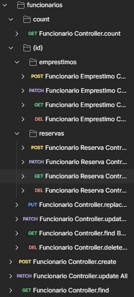
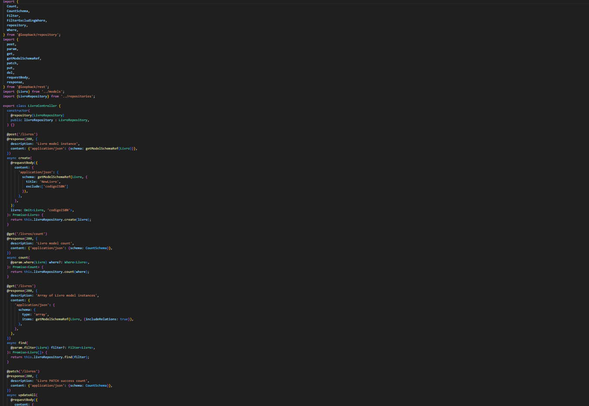
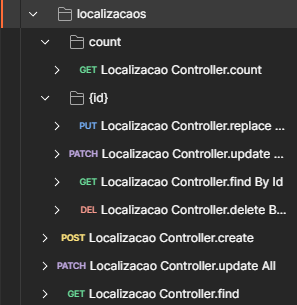
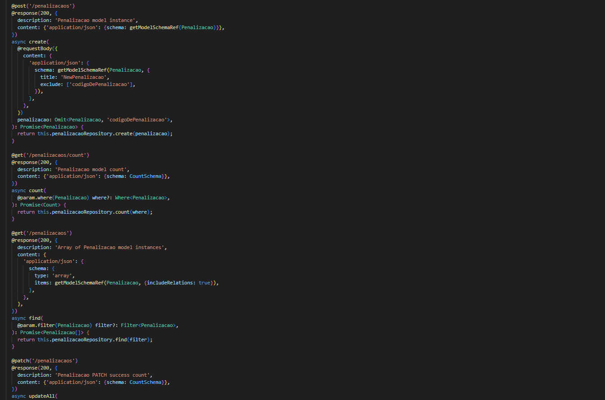
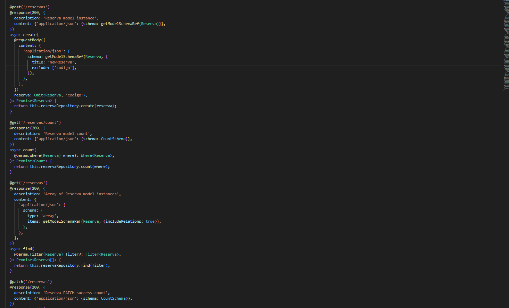
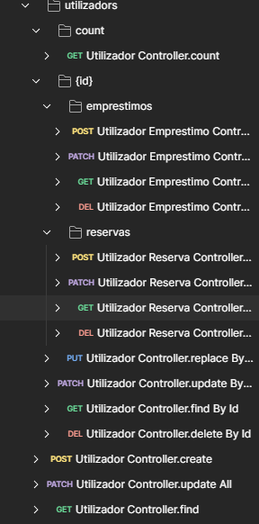
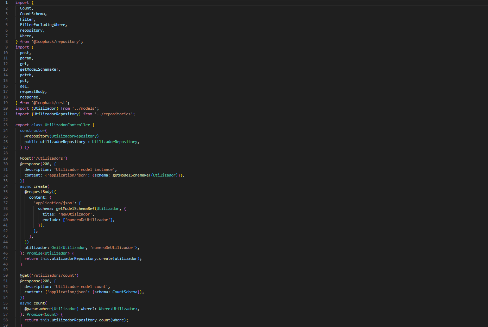

# C7 : Postman

---

## Organização Geral
---
- A coleção foi organizada por entidades(`EMPRESTIMOS`, `EXEMPLARS`, `FUNCIONARIOS`, `LIVROS`, `LOCALIZACAOS`, `PENALIZACAOS`, `RESERVAS`, `UTILIZADORS`)
---
- [EMPRESTIMOS](#EMPRESTIMOS)
- [EXEMPLARS](#EXEMPLARS)
- [FUNCIONARIOS](#FUNCIONARIOS)
- [LIVROS](#LIVROS)
- [LOCALIZACAOS](#LOCALIZACAOS)
- [PENALIZACAOS](#PENALIZACAOS)
- [RESERVAS](#RESERVAS)
- [UTILIZADORS](#UTILIZADORS)
---
### EMPRESTIMOS
- Inclui todos os métodos CRUD: `GET`, `POST`, `PATCH`, `PUT`, `DELETE`.
  
| Endpoint | Justificação |
|----------|--------------|
| `GET /emprestimo` | Consulta geral. |
| `GET /emprestimos/:id` | Consulta específica de um emprestimo. |
| `GET /emprestimos/:id/penalizacaos` ou com `filter` | Obtenção de emprestimos por penalização. |
| `POST`, `PUT`, `DELETE` | Incluídos porque os emprestimos são registados, editados ou removidos diretamente pelos administradores.

| Print EMPRESTIMO | Print Controller | 
|-------|-------|
|  |  | 

---

### Exemplars
- Inclui todos os métodos CRUD: `GET`, `POST`, `PATCH`, `PUT`, `DELETE`.
  
| Endpoint | Justificação |
|----------|--------------|
| `GET /exemplars` | Consulta geral. |
| `GET /exemplars/:id` | Consulta específica de um exemplar, alteração ou atualização. |
| `GET /exemplars/:id/localizacaos` ou com `filter` | Obtenção de exemplares por localização. |
| `POST`, `PUT`, `DELETE` | Incluídos porque os exemplares são registados, editados ou removidos diretamente pelos administradores.

| Print EXEMPLAR | Print Controller | 
|-------|-------|
|  |  | 

---

### FUNCIONARIOS
- Inclui todos os métodos CRUD: `GET`, `POST`, `PUT`, `DELETE`.

| Endpoint | Justificação |
|----------|--------------|
| `GET /funcionarios` | Consulta geral. |
| `GET /funcionarios/:id` | Consulta específica de um funcionario, alteração ou atualização. |
| `GET /funcionarios/:id/emprestimos`  | Obtenção de funcionarios por emprestimos. |
| `GET /funcionarios/:id/reservas` | Obtenção de funcionarios por reserva. |
| `POST`, `PUT`, `DELETE` | Incluídos porque os exemplares são registados, editados ou removidos diretamente pelos administradores.

| Print FUNCIONARIOS | Print Controller | 
|-------|-------|
|  |  | 

---

### LIVROS
- Inclui todos os métodos CRUD: `GET`, `POST`, `PATCH`, `PUT`, `DELETE`.

| Endpoint | Justificação |
|----------|--------------|
| `GET /livros` | Consulta geral. |
| `GET /livros/:id` | Consulta específica de um livro, alteração ou atualização. |
| `GET /livros/count` | Consulta específica da quantidade (número total) de livros.  |
| `GET /livros/:id/emprestimos`| Obtenção de livros por emprestimos. |
| `GET /livros/:id/exemplars`  | Obtenção de livros por emprestimos. |
| `GET /livros/:id/reservas`  | Obtenção de livros por reserva. |
| `POST`, `PUT`, `DELETE` | Os livros aqui são registrados, editados ou removidos diretamente pelos administradores.

| Print LIVROS | Print Controller | 
|-------|-------|
|  |  |

---

### LOCALIZACAOS
 - Inclui todos os métodos CRUD: `GET`, `POST`, `PATCH`, `PUT`, `DELETE`.

| Endpoint | Justificação |
|----------|--------------|
| `GET /localizacaos` | Consulta geral. |
| `GET /localizacaos/:id` | Consulta específica de uma localização, alteração ou atualização. |
| `GET /localizacaos/count` | Consulta específica da quantidade (número total) de localizaçãos.  |
| `POST`, `PUT`, `DELETE` | A localização aqui são registradas, editadas ou removidas diretamente pelos administradores.

| Print LOCALIZAÇÃO | Print Controller | 
|-------|-------|
|  |  |

---

### PENALIZACAOS
- Inclui todos os métodos CRUD: `GET`, `POST`, `PATCH`, `PUT`, `DELETE`.

| Endpoint | Justificação |
|----------|--------------|
| `GET /penalizacaos` | Consulta geral. |
| `GET /penalizacaos/:id` | Consulta específica de uma penalização, alteração ou atualização. |
| `GET /penalizacaos/count` | Consulta específica da quantidade (número total) de penalização.  |
| `POST`, `PUT`, `DELETE` | As penalizações aqui são registradas, editadas ou removidas diretamente pelos administradores.

| Print PENALIZAÇÃO | Print Controller | 
|-------|-------|
|  |  |

---

### RESERVAS
- Inclui todos os métodos CRUD: `GET`, `POST`, `PATCH`, `PUT`, `DELETE`.

| Endpoint | Justificação |
|----------|--------------|
| `GET /reservas` | Consulta geral. |
| `GET /reservas/:id` | Consulta específica de uma penalização, alteração ou atualização. |
| `GET /reservas/count` | Consulta específica da quantidade (número total) de reservas.  |
| `POST`, `PUT`, `DELETE` |As reservas aqui são registradas, editadas ou removidas diretamente pelos administradores.

| Print RESERVAS | Print Controller | 
|-------|-------|
|  |  |

---
### UTILIZADOR
- Inclui todos os métodos CRUD: `GET`, `POST`, `PATCH`, `PUT`, `DELETE`.

| Endpoint | Justificação |
|----------|--------------|
| `GET /utilizadors` | Consulta geral. |
| `GET /utilizadors/:id` | Consulta específica de uma penalização, alteração ou atualização. |
| `GET /utilizadors/count` | Consulta específica da quantidade (número total) de utilizadores.  |
| `GET /utilizadors/:id/emprestimos`| Obtenção de utilizadores por emprestimos. |
| `GET /utilizadors/:id/reservas`| Obtenção de utilizadores por reservas. |
| `POST`, `PUT`, `DELETE` | Os utilizadores aqui são registados, editados ou removidos diretamente pelos administradores.

| Print UTILIZADOR | Print Controller | 
|-------|-------|
|  |  |

---

## CRITÉRIOS PARA CADA METÓDO HTTP EM SEU CONTROLLERS REST:
| Verbo HTTP       | Quando Usar                                                                 | Quando Omitir                                                                       | Exemplos                                      |
|------------------|------------------------------------------------------------------------------|--------------------------------------------------------------------------------------|-----------------------------------------------|
| **GET**          | Listar recursos (`GET /entidades`); buscar item (`GET /entidades/{id}`)      | Se o recurso não deve ser exposto (ou só via relação)                                 | `GET /livros`, `GET /utilizadors/id`         |
| **POST**         | Criar novo recurso; acionar operação de negócio **non-idempotente**          | Usar para criar novos registros                                                       | `POST /emprestimo`                            |
| **PUT**          | Substituição completa de um recurso (cliente envia todos os campos)          | Em APIs de domínio complexo; se nem sempre se enviam todos os campos                  | `PUT /livros/id`                             |
| **PATCH**        | Atualização parcial de recurso (mudar um ou poucos atributos)                | Para mudar um ou poucos atributos                                                    | `PATCH /utilizadors/id`,                       |
| **DELETE**       | Remoção definitiva de recurso                                                | Violar integridade                                                                    | `DELETE /reservas/id`                         |

---

| [< Anterior](RPF06.md) | [^ Principal](../../README.md) | |
|:----------------------------------:|:----------------------------------:|:----------------------------------:|

