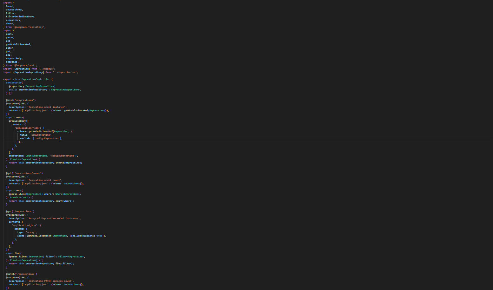

# C7 : Postman

---

## Organização Geral
A coleção foi organizada por entidades(`EMPRESTIMOS`, `EXEMPLARS`, `FUNCIONARIOS`, `LIVROS`, `LOCALIZACAOS`, `PENALIZACAOS`, `RESERVAS`, `UTILIZADORS`)
> **Nota:** Todos os métodos não utilizados foram deliberadamente omitidos da coleção, tendo sido apenas implementados os que respondem aos objetivos funcionais e à lógica do domínio da oficina.
---
- [EMPRESTIMOS](#EMPRESTIMOS)
- [EXEMPLARS](#EXEMPLARS)
- [FUNCIONARIOS](#FUNCIONARIOS)
- [LIVROS](#LIVROS)
- [LOCALIZACAOS](#LOCALIZACAOS)
- [PENALIZACAOS](#PENALIZACAOS)
- [RESERVAS](#RESERVAS)
- [UTILIZADORS](#UTILIZADORS)
---
### EMPRESTIMOS
- Inclui todos os métodos CRUD: `GET`, `POST`, `PUT`, `DELETE`.
  
| Endpoint | Justificação |
|----------|--------------|
| `GET /exemplar.controller` | Consulta geral. |
| `GET /emprestimos/:id` | Consulta específica de um emprestimo. |
| `GET /emprestimos/:id/penalizacaos` ou com `filter` | Obtenção de emprestimos por penalização. |
| `POST`, `PUT`, `DELETE` | Incluídos porque os emprestimos são registados, editados ou removidos diretamente pelos administradores.

<strong>EMPRESTIMOS – Ver print dos endpoints</strong>

| Print EMPRESTIMO | Print Controller | 
|-------|-------|
|  |  | 

---

### Exemplars
- Inclui todos os métodos CRUD: `GET`, `POST`, `PUT`, `DELETE`.
  
| Endpoint | Justificação |
|----------|--------------|
| `GET /exemplar.controller` | Consulta geral. |
| `GET /exemplar.controller/:id` | Consulta específica de um exemplar, alteração ou atualização. |
| `GET /exemplars/:id/localizacaos` ou com `filter` | Obtenção de exemplares por localização. |
| `POST`, `PUT`, `DELETE` | Incluídos porque os exemplares são registados, editados ou removidos diretamente pelos administradores.
| Print EXEMPLAR | Print Controller | 
|-------|-------|
|  |  | 
