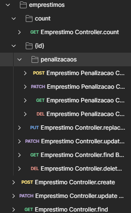
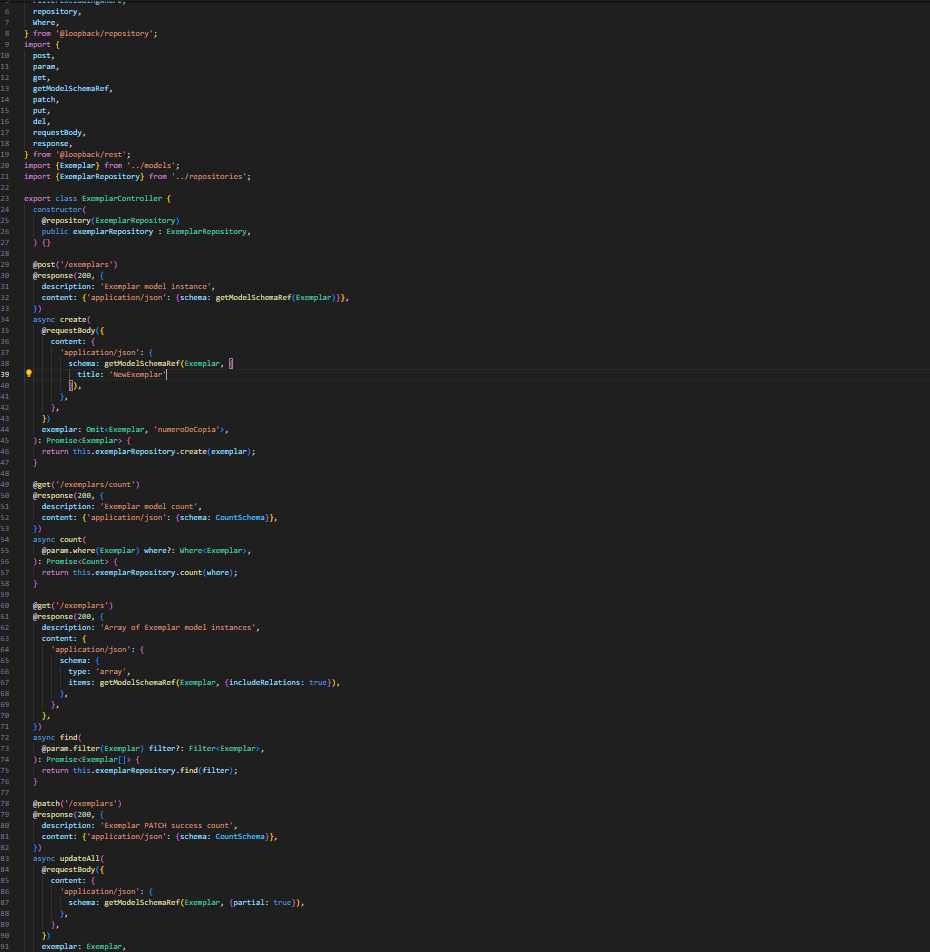
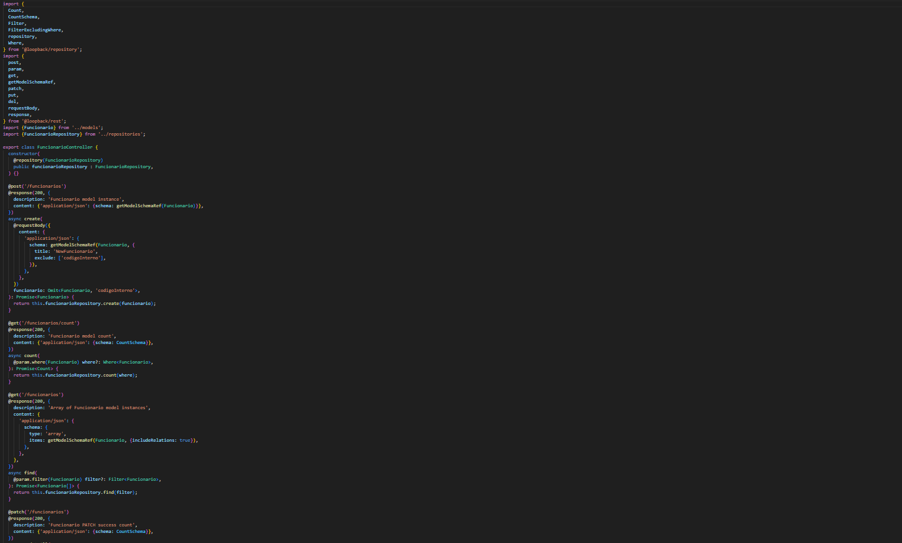
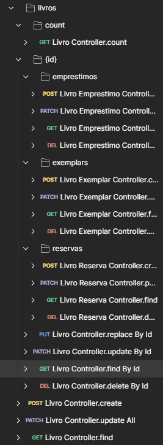
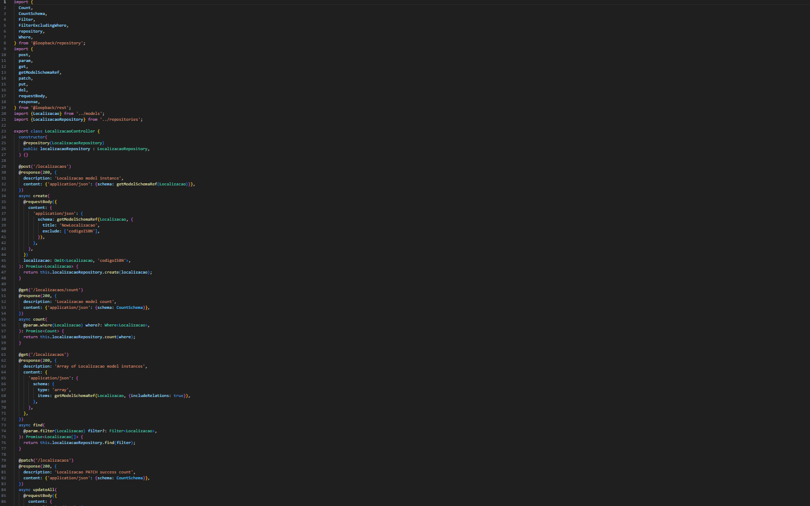
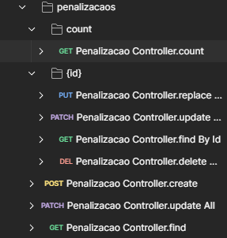
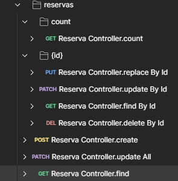

# C7 : Postman

---

## Organização Geral
---
- A coleção foi organizada por entidades(`EMPRESTIMO`, `EXEMPLAR`, `FUNCIONARIO`, `LIVRO`, `LOCALIZACAO`, `PENALIZACAO`, `RESERVA`, `UTILIZADOR`)
---
- [EMPRESTIMO](#EMPRESTIMO)
- [EXEMPLAR](#EXEMPLAR)
- [FUNCIONARIO](#FUNCIONARIO)
- [LIVRO](#LIVRO)
- [LOCALIZACAO](#LOCALIZACAO)
- [PENALIZACAO](#PENALIZACAO)
- [RESERVA](#RESERVA)
- [UTILIZADOR](#UTILIZADOR)
---
### EMPRESTIMO
- Inclui todos os métodos CRUD: `GET`, `POST`, `PATCH`, `PUT`, `DELETE`.
  
| Endpoint | Justificação |
|----------|--------------|
| `GET /emprestimo` | Consulta geral. |
| `GET /emprestimo/:id` | Consulta específica de um emprestimo. |
| `GET /emprestimo/:id/penalizacao` ou com `filter` | Obtenção de emprestimos por penalização. |
| `POST`, `PUT`, `DELETE` | Incluídos porque os emprestimos são registados, editados ou removidos diretamente pelos administradores.

| Print EMPRESTIMO | Print Controller | 
|-------|-------|
|  |  | 

---

### Exemplar
- Inclui todos os métodos CRUD: `GET`, `POST`, `PATCH`, `PUT`, `DELETE`.
  
| Endpoint | Justificação |
|----------|--------------|
| `GET /exemplar` | Consulta geral. |
| `GET /exemplar/:id` | Consulta específica de um exemplar, alteração ou atualização. |
| `GET /exemplar/:id/localizacao` ou com `filter` | Obtenção de exemplares por localização. |
| `POST`, `PUT`, `DELETE` | Incluídos porque os exemplares são registados, editados ou removidos diretamente pelos administradores.

| Print EXEMPLAR | Print Controller | 
|-------|-------|
|  |  | 

---

### FUNCIONARIO
- Inclui todos os métodos CRUD: `GET`, `POST`, `PUT`, `DELETE`.

| Endpoint | Justificação |
|----------|--------------|
| `GET /funcionario` | Consulta geral. |
| `GET /funcionario/:id` | Consulta específica de um funcionario, alteração ou atualização. |
| `GET /funcionario/:id/emprestimo`  | Obtenção de funcionarios por emprestimos. |
| `GET /funcionario/:id/reserva` | Obtenção de funcionarios por reserva. |
| `POST`, `PUT`, `DELETE` | Incluídos porque os exemplares são registados, editados ou removidos diretamente pelos administradores.

| Print FUNCIONARIO | Print Controller | 
|-------|-------|
|  |  | 

---

### LIVRO
- Inclui todos os métodos CRUD: `GET`, `POST`, `PATCH`, `PUT`, `DELETE`.

| Endpoint | Justificação |
|----------|--------------|
| `GET /livro` | Consulta geral. |
| `GET /livro/:id` | Consulta específica de um livro, alteração ou atualização. |
| `GET /livro/count` | Consulta específica da quantidade (número total) de livros.  |
| `GET /livro/:id/emprestimo`| Obtenção de livros por emprestimos. |
| `GET /livro/:id/exemplar`  | Obtenção de livros por emprestimos. |
| `GET /livro/:id/reserva`  | Obtenção de livros por reserva. |
| `POST`, `PUT`, `DELETE` | Os livros aqui são registrados, editados ou removidos diretamente pelos administradores.

| Print LIVRO | Print Controller | 
|-------|-------|
|  |  |

---

### LOCALIZACAO
 - Inclui todos os métodos CRUD: `GET`, `POST`, `PATCH`, `PUT`, `DELETE`.

| Endpoint | Justificação |
|----------|--------------|
| `GET /localizacao` | Consulta geral. |
| `GET /localizacao/:id` | Consulta específica de uma localização, alteração ou atualização. |
| `GET /localizacao/count` | Consulta específica da quantidade (número total) de localizaçãos.  |
| `POST`, `PUT`, `DELETE` | A localização aqui são registradas, editadas ou removidas diretamente pelos administradores.

| Print LOCALIZACAO | Print Controller | 
|-------|-------|
|  |  |

---

### PENALIZACAO
- Inclui todos os métodos CRUD: `GET`, `POST`, `PATCH`, `PUT`, `DELETE`.

| Endpoint | Justificação |
|----------|--------------|
| `GET /penalizacao` | Consulta geral. |
| `GET /penalizacao/:id` | Consulta específica de uma penalização, alteração ou atualização. |
| `GET /penalizacao/count` | Consulta específica da quantidade (número total) de penalização.  |
| `POST`, `PUT`, `DELETE` | As penalizações aqui são registradas, editadas ou removidas diretamente pelos administradores.

| Print PENALIZACAO | Print Controller | 
|-------|-------|
|  |  |

---

### RESERVA
- Inclui todos os métodos CRUD: `GET`, `POST`, `PATCH`, `PUT`, `DELETE`.

| Endpoint | Justificação |
|----------|--------------|
| `GET /reserva` | Consulta geral. |
| `GET /reserva/:id` | Consulta específica de uma penalização, alteração ou atualização. |
| `GET /reserva/count` | Consulta específica da quantidade (número total) de reservas.  |
| `POST`, `PUT`, `DELETE` |As reservas aqui são registradas, editadas ou removidas diretamente pelos administradores.

| Print RESERVA | Print Controller | 
|-------|-------|
|  |  |

---
### UTILIZADOR
- Inclui todos os métodos CRUD: `GET`, `POST`, `PATCH`, `PUT`, `DELETE`.

| Endpoint | Justificação |
|----------|--------------|
| `GET /utilizador` | Consulta geral. |
| `GET /utilizador/:id` | Consulta específica de uma penalização, alteração ou atualização. |
| `GET /utilizador/count` | Consulta específica da quantidade (número total) de utilizadores.  |
| `GET /utilizador/:id/emprestimo`| Obtenção de utilizadores por emprestimos. |
| `GET /utilizador/:id/reserva`| Obtenção de utilizadores por reservas. |
| `POST`, `PUT`, `DELETE` | Os utilizadores aqui são registados, editados ou removidos diretamente pelos administradores.

| Print UTILIZADOR | Print Controller | 
|-------|-------|
|  |  |

---

## CRITÉRIOS PARA CADA METÓDO HTTP EM SEU CONTROLLERS REST:
| Verbo HTTP       | Quando Usar                                                                 | Quando Omitir                                                                       | Exemplos                                      |
|------------------|------------------------------------------------------------------------------|--------------------------------------------------------------------------------------|-----------------------------------------------|
| **GET**          | Listar recursos (`GET /entidades`); buscar item (`GET /entidades/{id}`)      | Se o recurso não deve ser exposto (ou só via relação)                                 | `GET /livro`, `GET /utilizador/id`         |
| **POST**         | Criar novo recurso; acionar operação de negócio **non-idempotente**          | Usar para criar novos registros                                                       | `POST /emprestimo`                            |
| **PUT**          | Substituição completa de um recurso (cliente envia todos os campos)          | Em APIs de domínio complexo; se nem sempre se enviam todos os campos                  | `PUT /livro/id`                             |
| **PATCH**        | Atualização parcial de recurso (mudar um ou poucos atributos)                | Para mudar um ou poucos atributos                                                    | `PATCH /utilizador/id`,                       |
| **DELETE**       | Remoção definitiva de recurso                                                | Violar integridade                                                                    | `DELETE /reserva/id`                         |

---

| [< Anterior](RPF06.md) | [^ Principal](../../README.md) | |
|:----------------------------------:|:----------------------------------:|:----------------------------------:|

